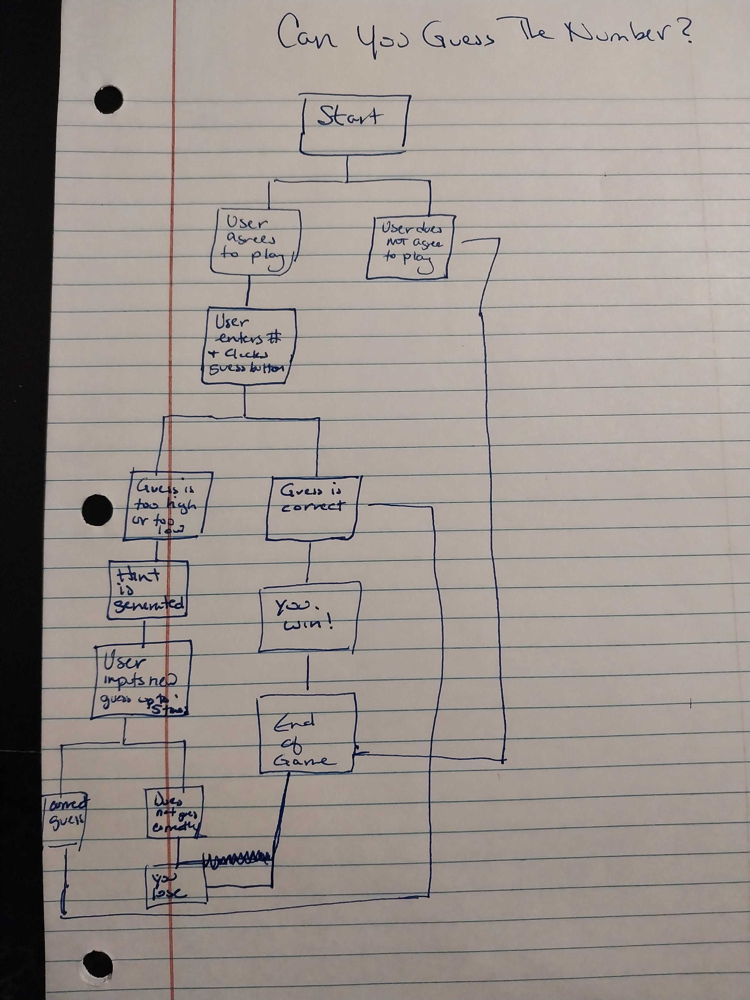
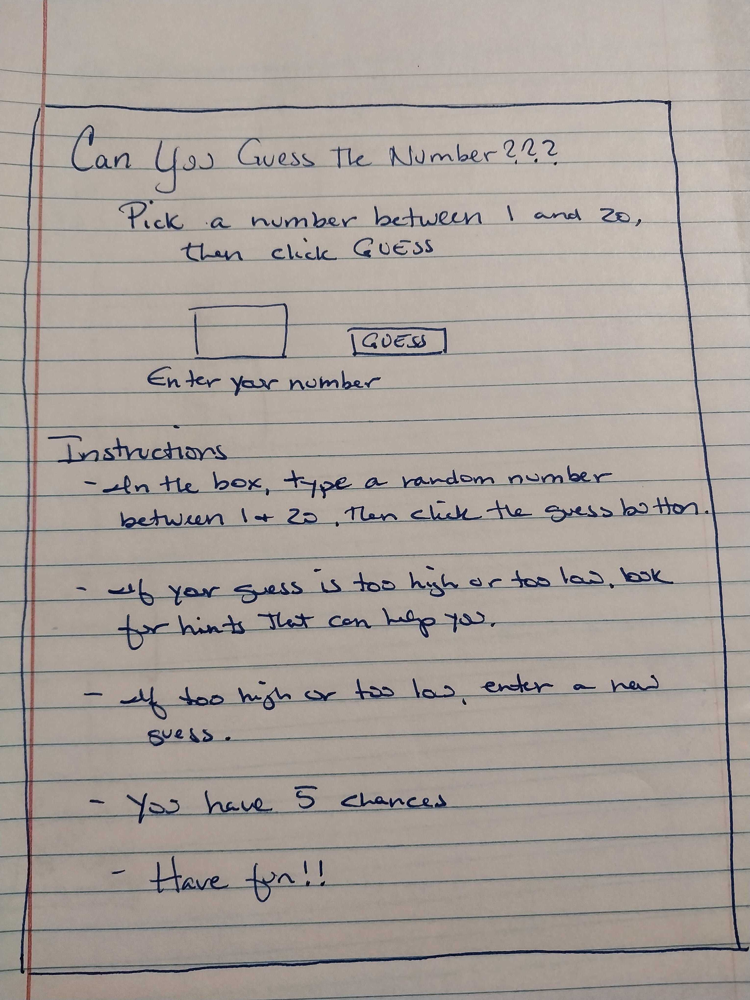

<<h1>Can you Guess My Secret Number?</h1>

A single-player game where you match wits against a Genie to guess his Secret Number!

<h2>How to Play:</h2>
To start the game, click the button that reads "Open Sesame".  Click ok to start guessing.  (Note:  If you click cancel, the game will end and you will be invited to come back another time.) The Genie tells you that you have 3 chances to guess his Secret Number.  With each entry, that does not match his Secret Number, you will be given a hint.  If you use all 3 chances and do not guess, the game ends, however, you will be given the option to try again.  If you guess the Genie's Secret Number within 3 guesses, you will be granted a wish with instructions on how to activate your wish.  It's a simple but you will have fun!
<h2>Flowchart</h2>

<h2>Wireframe<h2>
  
  

<h3>Credits:</h3>
https://www.youtube.com/watch?v=Lfl4XGkQVoY
https://developer.mozilla.org/en-US/docs/Web/CSS/CSS_backgrounds_and_borders/Resizing_background_images
https://www.codingforcats.com/css/how-to-set-font-family.php
https://www.w3schools.com/jsref/jsref_operators.asp#:~:text=JavaScript%20String%20Operators,to%20concatenate%20(add)%20strings.
WeiWei (game idea :) )

<h3>Tech Used</h3>
- HTML 
- CSS 
- JS 

<h3>Future Updates</h3>
- After each guess, Genie tells how many tries are left. 
- If an entry is made that is either not within range or is a letter or symbol, you are given an error. 
- If nothing is entered, you receive an error and lose a chance to guess. 
- Dark background and stars. 
- If you guess his Secret Number, Genie tells how many guesses it took you. 
- Genie tells you your previous guesses. 
